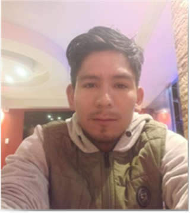

{width=20% align=center}

**Universidad Peruana de Ciencias Aplicadas**

Ingeniería de Software

Ciclo: VIII

Sección: WS82

Profesor: Royer Edelwer Rojas Malasquez

**INFORME DE TRABAJO FINAL**

FastPorte

Botello Saldarriaga, Anthony Jean Pierre U20201B846
Cierto Espiritu, Abel Angel U20201B561
Lévano Cavero, Eduardo Sebastián U20201C172
Sabino Ramírez, Rodrigo Alexander U20201B801
Villegas Peralta, Branco Alberto U20201C082

Abril, 2024

---

# Registro de Versiones del Informe

| Versión | Fecha    | Autor            | Descripción de modificación                                                      |
| ------- | -------- | ---------------- | -------------------------------------------------------------------------------- |
| 1.0     | 12/04/24 | Sebastián Lévano | Creación del proyecto con Markdown Introducción del proyecto Cap I, II, III y IV |

# Contenido

# Student Outcome

| Criterio específico                                                                                                                                                                    | Acciones realizadas | Conclusiones |
| -------------------------------------------------------------------------------------------------------------------------------------------------------------------------------------- | ------------------- | ------------ |
| Comunica oralmente sus ideas y/o resultados con objetividad a público de diferentes especialidades y niveles jerarquicos, en el marco del desarrollo de un proyecto en ingeniería.     |                     | TB1          |
| Comunica en forma escrita ideas y/o resultados con objetividad a público de diferentes especialidades y niveles jerarquicos, en el marco del desarrollo de un proyecto en ingeniería.. |                     | TB1          |

---

# Capítulo I: Introducción

## 1.1. Startup Profile

### 1.1.1. Descripción de la Startup

Somos un grupo de estudiantes de la Universidad Peruana de Ciencias Aplicadas y en conjunto identificamos una oportunidad de negocio relacionada con el sector transporte, precisando en el transporte de mercadería.

Nos dimos cuenta de que conseguir transporte de carga, mudanza, envío de paquetes, etc., cuando eres un cliente que necesita de ese servicio, no es muy práctico y sencillo, ya sea por diversas razones: no contar con ese tipo de contactos, no saber dónde buscar, confiabilidad, entre otros. Todo esto hace que la situación se complique cuando un cliente normal, un usuario del día a día que necesite servicios de este rubro, se vea limitado en opciones. Por otro lado, sabemos que existen transportistas independientes que brindan el servicio de movilidad particular ya sea para diferentes rubros y que no tienen la oportunidad de llegar a más personas que las de su propio entorno, lo que hace poco variado su lista de clientes y por ende limita su círculo de trabajo.

Por lo anterior expuesto, hemos creado FastPorte, una plataforma que conecta transportistas de los rubros de carga, mudanza, envío de paquetes, etc. con personas (clientes o personas naturales) que requieren de sus servicios. Funcionará de la siguiente manera: un transportista se registrará con sus datos personales, completará su perfil, incluyendo sus datos personales, documentación tales como: licencia y permisos, tipo de vehículo y tipo de transporte brinda, cuenta bancaria (la cual la aplicación utilizará para depositarle el porcentaje correspondiente al ser contratado por un cliente) y la región en la que labura. Finalmente, esperará a que un cliente lo contacte. Por otro lado, una persona que requiera de transporte se registrará con sus datos personales, buscará a un transportista por el rubro que necesite, podrá visualizar el tipo de transporte y el vehículo usado por dicho usuario transportista, la zona donde brinda el servicio o hasta dónde puede llegar, así como las reseñas de anteriores clientes que tuvieron el servicio con él y de elegirlo, tendrá que rellenar un formulario con los detalles del viaje y hacer el pago del servicio mediante la aplicación, que estará conectada a un servicio de pagos. Finalmente, el transportista acudirá al lugar acordado.

##### MISIÓN

Hacer la búsqueda de servicio de transporte para traslado de mercadería o paquetes, confiable y seguro para cada usuario.

##### VISIÓN

Convertirnos en el servicio de búsqueda de transportes preferido por los peruanos que cada vez supere aún más las expectativas de cada cliente.

### 1.1.2. Perfiles de integrantes del equipo

| Integrante                                                                                                                                                                                                                                                                                                                                                                                                                                                                                                         | Eduardo Sebastián Lévano Cavero                    |
| ------------------------------------------------------------------------------------------------------------------------------------------------------------------------------------------------------------------------------------------------------------------------------------------------------------------------------------------------------------------------------------------------------------------------------------------------------------------------------------------------------------------ | -------------------------------------------------- |
| Mi nombre es Sebastián, tengo 21 años y soy estudiante de Ingeniería de Software en la Universidad Peruana de Ciencias Aplicadas. Elegí esta carrera porque me fascina crear y diseñar procesos que faciliten procesos complejos. Por ello, cuando tengo un poco de tiempo libre lo uso para relajarme y para aprender más de lo que me apasiona, la programación, se puede decir que es uno de mis hobbies. Además, de la programación también disfruto de jugar vóley, fútbol o algún videojuego con mis amigos. |  |

| Integrante                                                                                                                                                                                                                                                                                                                                                                                                                 | Botello Saldarriaga, Anthony Jean Pierre       |
| -------------------------------------------------------------------------------------------------------------------------------------------------------------------------------------------------------------------------------------------------------------------------------------------------------------------------------------------------------------------------------------------------------------------------- | ---------------------------------------------- |
| Tengo 21 años y soy estudiante de Ingeniería de Software con conocimientos de matemática y habilidades en programación en el lenguaje C++. Actualmente curso el sétimo ciclo de la carrera y mi meta es ser un profesional destacado el cual rija sus decisiones por sus valores y el bien de la cliente donde labore. Me interesa el desarrollo de la tecnología y los avances que existen en la inteligencia artificial. |  |

| Integrante                                                                                                                                                                                                                                                                                                                                                                                           | Sabino Ramírez, Rodrigo Alexander              |
| ---------------------------------------------------------------------------------------------------------------------------------------------------------------------------------------------------------------------------------------------------------------------------------------------------------------------------------------------------------------------------------------------------- | ---------------------------------------------- |
| Estudiante de sétimo ciclo de la carrera de Ingeniería de Software. Me considero una persona proactiva con pensamiento estratégico, con habilidades en el ámbito de la programación y un gran espíritu investigador. Para este proyecto puedo aportar parte de mi conocimiento adquirido en el curso. Además, de las habilidades blandas tales como el trabajo en equipo, comunicación, entre otras. |  |

| Integrante                                                                                                                                                                                                                                                                                                                                                                                                                                                                                                                                                                                                                                                                                                                                                                                                                                                                                                                                                                    | Villegas Peralta, Branco Alberto             |
| ----------------------------------------------------------------------------------------------------------------------------------------------------------------------------------------------------------------------------------------------------------------------------------------------------------------------------------------------------------------------------------------------------------------------------------------------------------------------------------------------------------------------------------------------------------------------------------------------------------------------------------------------------------------------------------------------------------------------------------------------------------------------------------------------------------------------------------------------------------------------------------------------------------------------------------------------------------------------------- | -------------------------------------------- |
| Estudiante en el octavo ciclo de la carrera de Ingeniería de Software en la Universidad Peruana de Ciencias Aplicadas, me destaco por mi firme compromiso con la excelencia académica, respaldado por una actitud proactiva y una comunicación efectiva. Esta combinación me capacita para abordar desafíos con determinación y encontrar soluciones eficaces de manera constante. Mi capacidad para mantener la empatía y la tolerancia en situaciones diversas me facilita trabajar de manera colaborativa en equipo y adaptarme sin dificultad a diversos entornos. En términos de habilidades técnicas, poseo sólidos fundamentos en desarrollo web, destacándome en HTML, CSS y JavaScript, lo que me permite crear interfaces atractivas y funcionales. Además, mi dominio versátil en lenguajes de programación como C++, Python, Java, SQL y C# me permite afrontar desafíos desde múltiples perspectivas y encontrar soluciones innovadoras en diferentes contextos. |  |

| Integrante                                                                                                                                                                                                                                                                                                                                                                                                                                                                                                                                                                       | Cierto Espíritu, Abel Angel              |
| -------------------------------------------------------------------------------------------------------------------------------------------------------------------------------------------------------------------------------------------------------------------------------------------------------------------------------------------------------------------------------------------------------------------------------------------------------------------------------------------------------------------------------------------------------------------------------- | ---------------------------------------- |
| Estudiante en el octavo ciclo de la carrera de Ingeniería de Software en la Universidad Peruana de Ciencias Aplicadas, me encanta la programación y durante el avance de la carrera adquirí habilidades en lenguajes de programación como C++, C#, Python, TypeScript, Java y SQL para base datos. Asimismo, aprendí acerca de frameworks como Angular, Vue y el desarrollo de aplicaciones móviles en Flutter. En síntesis, estoy dispuesto a ser parte de este equipo de desarrollo y seguir aprendiendo nuevas habilidades en torno a la arquitectura de software emergentes. |  |

## 1.2. Solution Profile

El producto que proponemos como equipo es FastPorte una aplicación que permite conectar a transportistas con personas que requieran de su servicio. Este proceso se llevará a cabo de manera sencilla, accesible y segura, tanto para el cliente como para los transportistas.

### 1.2.1. Antecedentes y Problemática

##### ANTECEDENTES:

Con respecto a nuestra propuesta, nuestra competencia es la siguiente:

- **Trippy Perú:** Herramienta móvil desarrollada en Perú que permite a los padres registrados el poder visualizar la ubicación en tiempo real de la movilidad de sus hijos.
- **MiCargaApp:** Aplicación peruana que conecta a usuarios con clientes que requieran enviar cargas a partir de una tonelada a cualquier ciudad del país. Permite transportar todo tipo de carga, desde mudanzas hasta líquidos peligrosos.
- **MuberZ:** Es una aplicación para mudanzas pequeñas o de productos específicos como un electrodoméstico en Lima. El servicio puede incluir únicamente el traslado, así como el embalaje y el desembalaje.

##### PROBLEMÁTICA

- **What(Qué)**
  En la actualidad existen diversas aplicaciones que ofrecen el servicio de transporte, sin embargo, la mayoría de estas están enfocadas en el ámbito urbano como: Uber, Didi, Cabify, etc. Nosotros proponemos una solución para el ámbito de mercadería o transporte de carga. De esta manera, facilitaremos tanto para el transportista como el cliente la forma de contactar y gozar de un buen servicio.
- **When(Cuando)**
  La problemática surge al momento en que alguien busca un medio de transporte para el rubro de transporte de mercadería o carga. En muchas ocasiones, solo encontramos servicios de taxi que ofrecen diferentes aplicaciones. Sin embargo, no sabemos dónde buscar cuando requerimos de transporte más grande o de mayor capacidad, ya sea para transportar mercadería en cajas o cantidades mucho más grandes de carga de algún tipo.
- **Where(Dónde)**
  Nuestro servicio se dará a nivel nacional en un futuro, sin embargo, por ahora, y para comenzar, nos consolidaremos en la capital y luego iremos creciendo hacia otras regiones para cumplir con nuestra visión como startup.
- **Who(Quién)**
  **FastPorte** está dirigida a todas las personas que deseen encontrar de manera más rápida y confiable un servicio de transporte de carga según la disponibilidad. Por otra parte, también está dirigido a todos los transportistas que quieran brindar este servicio, ampliar su zona de servicio y atraer a más clientes potenciales a contratarlos para así obtener más ingresos.
- **Why(Por qué)**
  Como mencionamos anteriormente, esta propuesta se plantea por la necesidad de una plataforma en la cual los transportistas particulares ligados al rubro de transporte de carga puedan ofrecer sus servicios y que las personas o clientes puedan ver que tienen opciones y elegir el tipo de servicio que requieren. Además, porque será un espacio donde los trabajadores que se dediquen a transportar ya sean carga, mercadería, paquetes, etc., de forma particular podrán aumentar su público y por ende obtener más ganancias.
- **How(Cómo)**
  Funcionará de la siguiente manera: un transportista se registrará con sus datos personales, completará su perfil, incluyendo sus datos personales, documentación tales como: licencia y permisos, tipo de vehículo y tipo de transporte brinda, cuenta bancaria (la cual la aplicación utilizará para depositarle el porcentaje correspondiente al ser contratado por un cliente), el lugar por donde circula y hasta que trayecto puede llegar, finalmente esperará a que un cliente lo contacte. Por otro lado, una persona que requiera de transporte se registrará con sus datos personales, buscará a un transportista por el rubro que necesite, podrá visualizar el tipo de transporte y el vehículo usado por dicho usuario transportista, la zona donde brinda el servicio o hasta dónde puede llegar, así como las reseñas de anteriores clientes que tuvieron el servicio con él y de elegirlo, tendrá que rellenar un formulario con los detalles del viaje y hacer el pago del servicio mediante la aplicación, que estará conectada a una pasarela de pagos.
- **How much(Cuánto)**
  En el Perú son pocas las clientes que compiten directamente con nosotros ya que la mayoría de las aplicaciones de transporte están enfocadas solo a la mudanza o al transporte de carga pesada mayor a una tonelada. Por lo tanto, seríamos el único startup que abarque el área de transporte de carga sin limitaciones, desde solicitar un miniván para transportar un par de cajas hasta solicitar transporte de carga pesada para mercadería, encargos pesados, etc.

### 1.2.2. Lean UX Process

#### 1.2.2.1. Lean UX Problem Statements

#### 1.2.2.2. Lean UX Assumptions

#### 1.2.2.3. Lean UX Hypothesis Statements

#### 1.2.2.4. Lean UX Canvas

## 1.3. Segmentos Objetivo
