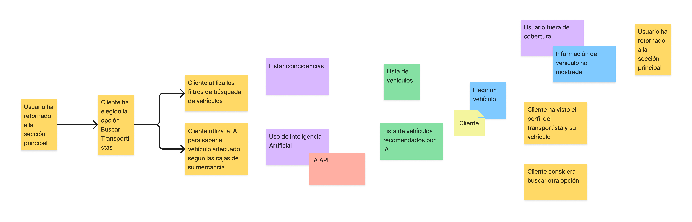
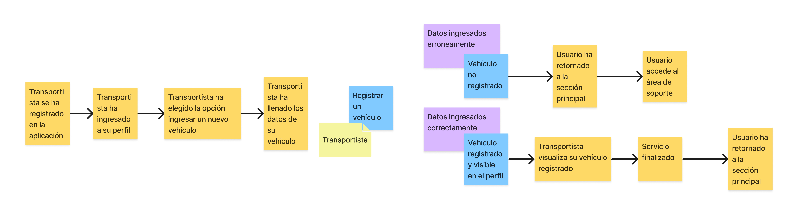
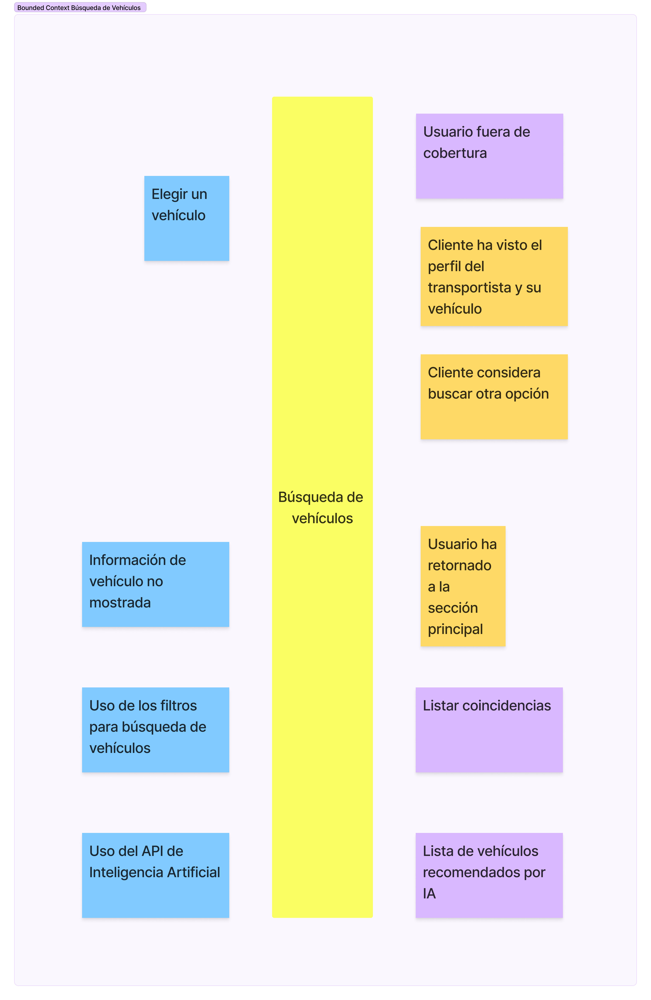
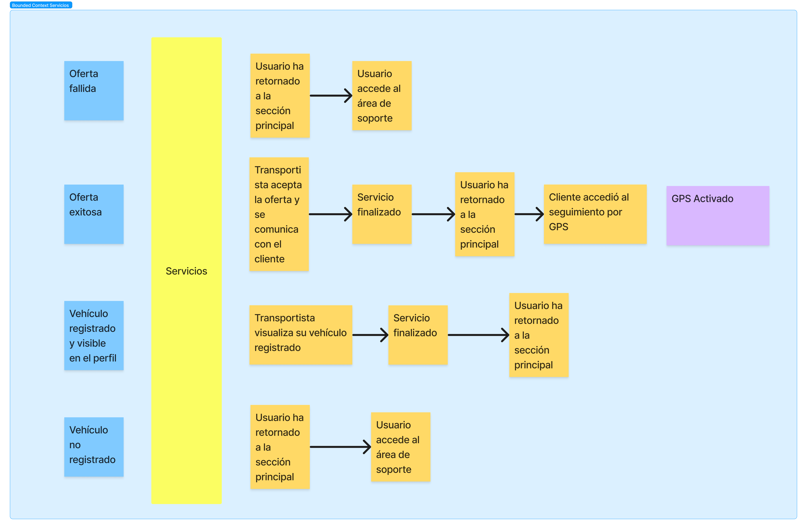

**Universidad Peruana de Ciencias Aplicadas**

Ingeniería de Software

Ciclo: VIII

Sección: WS82

Profesor: Royer Edelwer Rojas Malasquez

**INFORME DE TRABAJO FINAL**

**FastPorte**

Integrantes:

* Botello Saldarriaga, Anthony Jean Pierre - U20201B846
* Cierto Espiritu, Abel Angel - U20201B561
* Lévano Cavero, Eduardo Sebastián - U20201C172
* Sabino Ramírez, Rodrigo Alexander - U20201B801
* Villegas Peralta, Branco Alberto - U20201C082

Abril, 2024

---

# Registro de Versiones del Informe

| Versión | Fecha    | Autor            | Descripción de modificación                                                      |
| ------- | -------- | ---------------- | -------------------------------------------------------------------------------- |
| 1.0     | 12/04/24 | Sebastián Lévano | Creación del proyecto con Markdown Introducción del proyecto Cap I, II, III y IV |

# Contenido
- [Student Outcome](#student-outcome)
- [Capítulo I: Introducción](#capítulo-i-introducción)
  - [1.1. Startup Profile](#11-startup-profile)
    - [1.1.1. Descripción de la Startup](#111-descripción-de-la-startup)
    - [1.1.2. Perfiles de integrantes del equipo](#112-perfiles-de-integrantes-del-equipo)
  - [1.2. Solution Profile](#12-solution-profile)
    - [1.2.1. Antecedentes y Problemática](#121-antecedentes-y-problemática)
    - [1.2.2. Lean UX Process](#122-lean-ux-process)
        - [1.2.2.1. Lean UX Problem Statements](#1221-lean-ux-problem-statements)
        - [1.2.2.2.	Lean UX Assumptions](#1222-lean-ux-assumptions)
        - [1.2.2.3. Lean UX Hypothesis Statements](#1223-lean-ux-hypothesis-statements)
        - [1.2.2.4. Lean UX Canvas](#1224-lean-ux-canvas)
  - [1.3. Segmentos Objetivo](#13-segmentos-objetivo)
- [Capítulo II: Requirements Elicitation & Analysis](#capítulo-ii-requirements-elicitation--analysis)
  - [2.1. Competidores](#211-competidores)
    - [2.1.1. Análisis Competitivo](#211-análisis-competitivo)
    - [2.1.2. Estrategias y tácticas frente a competidores](#212-estrategias-y-tácticas-frente-a-competidores)
  - [2.2. Entrevistas](#22-entrevistas)
    - [2.2.1. Diseño de entrevistas](#221-diseño-de-entrevistas)
    - [2.2.2. Registro de entrevistas](#222-registro-de-entrevistas)
    - [2.2.3. Análisis de entrevistas](#223-análisis-de-entrevistas)
  - [2.3. Needfinding](#23-needfinding)
    - [2.3.1. User Personas](#231-user-personas)
    - [2.3.2. User Task Matrix](#232-user-task-matrix)
    - [2.3.3. Empathy Mapping](#233-empathy-mapping)
    - [2.3.4. As-is Scenario Mapping](#234-as-is-scenario-mapping)
  - [2.4. Ubiquitous Language](#24-ubiquitous-language)
- [Capítulo III: Requirements Specification](#capítulo-iii-requirements-specification)
  - [3.1. To-Be Scenario Mapping](#31-to-be-scenario-mapping)
  - [3.2. User Stories](#32-user-stories)
  - [3.3. Impact Mapping](#33-impact-mapping)
  - [3.4. Product Backlog](#34-product-backlog)
- [Capítulo IV: Strategic-Level Software Design]()
  - [4.2. Strategic-Level Domain-Driven Design](#42-strategic-level-domain-driven-design)
	- [4.2.1. EventStorming](#421-eventstorming)
	- [4.2.2. Candidate Context Discovery](#422-candidate-context-discovery)
	- [4.2.3 Domain Message Flows Modeling](#423-domain-message-flows-modeling)
	- [4.2.4 Bounded Context Canvases](#424-bounded-context-canvases)
	- [4.2.5 Context Mapping](#424-bounded-context-canvases)

# Student Outcome

| Criterio específico                                                                                                                                                                    | Acciones realizadas                                                                                                                                                                                                                                                                                                                                                                                                  | Conclusiones |
| -------------------------------------------------------------------------------------------------------------------------------------------------------------------------------------- | -------------------------------------------------------------------------------------------------------------------------------------------------------------------------------------------------------------------------------------------------------------------------------------------------------------------------------------------------------------------------------------------------------------------- | ------------ |
| Comunica oralmente sus ideas y/o resultados con objetividad a público de diferentes especialidades y niveles jerarquicos, en el marco del desarrollo de un proyecto en ingeniería.     | **Eduardo Sebastián Lévano Cavero** *TB1*  - Durante el video de exposición se transmitió de manera adecuada la problemática hallada en el sector de transporte de mercadería y como se solucionaría por medio de la implementación de una página web para comunicar a transportistas con personas que requieran de sus servicios. Asimismo, se detallo como esta diseñada la propuesta y su sustentación.   **Anthony Botello**  *TB1*  - En el vídeo de exposición se indicaron a los competidores, así como también se explicó la matriz DAFO de nuestra organización. Finalmente, se expusieron resultados acerca de las entrevistas realizadas.| TB1          |
| Comunica en forma escrita ideas y/o resultados con objetividad a público de diferentes especialidades y niveles jerarquicos, en el marco del desarrollo de un proyecto en ingeniería.. | **Eduardo Sebastián Lévano Cavero** *TB1*  - Se documento con éxito y de manera adecuada la introducción al proyecto, describiendo la problemática con antecedentes, ilustrando las posibles soluciones y como se busca solucionarlo de una manera más eficiente por medio del desarrollo de la presenta investigación.   **Anthony Botello**  *TB1*  - Se redactaron y documentó información y análisis de nuestros competidores y de la misma forma se evidenciaron las entrevistas realizadas y el análisis de ellas. Por otro lado, se definieron los Primary User Stories y los Quality Attribute Scenarios.                                                                                    | TB1          |

---

# Capítulo I: Introducción

## 1.1. Startup Profile

### 1.1.1. Descripción de la Startup

Somos un grupo de estudiantes de la Universidad Peruana de Ciencias Aplicadas y en conjunto identificamos una oportunidad de negocio relacionada con el sector transporte, precisando en el transporte de mercadería.

Nos dimos cuenta de que conseguir transporte de carga, mudanza, envío de paquetes, etc., cuando eres un cliente que necesita de ese servicio, no es muy práctico y sencillo, ya sea por diversas razones: no contar con ese tipo de contactos, no saber dónde buscar, confiabilidad, entre otros. Todo esto hace que la situación se complique cuando un cliente normal, un usuario del día a día que necesite servicios de este rubro, se vea limitado en opciones. Por otro lado, sabemos que existen transportistas independientes que brindan el servicio de movilidad particular ya sea para diferentes rubros y que no tienen la oportunidad de llegar a más personas que las de su propio entorno, lo que hace poco variado su lista de clientes y por ende limita su círculo de trabajo.

Por lo anterior expuesto, hemos creado FastPorte, una plataforma que conecta transportistas de los rubros de carga, mudanza, envío de paquetes, etc. con personas (clientes o personas naturales) que requieren de sus servicios. Funcionará de la siguiente manera: un transportista se registrará con sus datos personales, completará su perfil, incluyendo sus datos personales, documentación tales como: licencia y permisos, tipo de vehículo y tipo de transporte brinda, cuenta bancaria (la cual la aplicación utilizará para depositarle el porcentaje correspondiente al ser contratado por un cliente) y la región en la que labura. Finalmente, esperará a que un cliente lo contacte. Por otro lado, una persona que requiera de transporte se registrará con sus datos personales, buscará a un transportista por el rubro que necesite, podrá visualizar el tipo de transporte y el vehículo usado por dicho usuario transportista, la zona donde brinda el servicio o hasta dónde puede llegar, así como las reseñas de anteriores clientes que tuvieron el servicio con él y de elegirlo, tendrá que rellenar un formulario con los detalles del viaje y hacer el pago del servicio mediante la aplicación, que estará conectada a un servicio de pagos. Finalmente, el transportista acudirá al lugar acordado.

##### MISIÓN

Hacer la búsqueda de servicio de transporte para traslado de mercadería o paquetes, confiable y seguro para cada usuario.

##### VISIÓN

Convertirnos en el servicio de búsqueda de transportes preferido por los peruanos que cada vez supere aún más las expectativas de cada cliente.

### 1.1.2. Perfiles de integrantes del equipo

| Integrante                                                                                                                                                                                                                                                                                                                                                                                                                                                                                                         | Eduardo Sebastián Lévano Cavero                    |
| ------------------------------------------------------------------------------------------------------------------------------------------------------------------------------------------------------------------------------------------------------------------------------------------------------------------------------------------------------------------------------------------------------------------------------------------------------------------------------------------------------------------ | -------------------------------------------------- |
| Mi nombre es Sebastián, tengo 21 años y soy estudiante de Ingeniería de Software en la Universidad Peruana de Ciencias Aplicadas. Elegí esta carrera porque me fascina crear y diseñar procesos que faciliten procesos complejos. Por ello, cuando tengo un poco de tiempo libre lo uso para relajarme y para aprender más de lo que me apasiona, la programación, se puede decir que es uno de mis hobbies. Además, de la programación también disfruto de jugar vóley, fútbol o algún videojuego con mis amigos. |  |

| Integrante                                                                                                                                                                                                                                                                                                                                                                                                                 | Botello Saldarriaga, Anthony Jean Pierre       |
| -------------------------------------------------------------------------------------------------------------------------------------------------------------------------------------------------------------------------------------------------------------------------------------------------------------------------------------------------------------------------------------------------------------------------- | ---------------------------------------------- |
| Tengo 21 años y soy estudiante de Ingeniería de Software con conocimientos de matemática y habilidades en programación en el lenguaje C++. Actualmente curso el sétimo ciclo de la carrera y mi meta es ser un profesional destacado el cual rija sus decisiones por sus valores y el bien de la cliente donde labore. Me interesa el desarrollo de la tecnología y los avances que existen en la inteligencia artificial. |  |

| Integrante                                                                                                                                                                                                                                                                                                                                                                                           | Sabino Ramírez, Rodrigo Alexander              |
| ---------------------------------------------------------------------------------------------------------------------------------------------------------------------------------------------------------------------------------------------------------------------------------------------------------------------------------------------------------------------------------------------------- | ---------------------------------------------- |
| Estudiante de sétimo ciclo de la carrera de Ingeniería de Software. Me considero una persona proactiva con pensamiento estratégico, con habilidades en el ámbito de la programación y un gran espíritu investigador. Para este proyecto puedo aportar parte de mi conocimiento adquirido en el curso. Además, de las habilidades blandas tales como el trabajo en equipo, comunicación, entre otras. |  |

| Integrante                                                                                                                                                                                                                                                                                                                                                                                                                                                                                                                                                                                                                                                                                                                                                                                                                                                                                                                                                                    | Villegas Peralta, Branco Alberto             |
| ----------------------------------------------------------------------------------------------------------------------------------------------------------------------------------------------------------------------------------------------------------------------------------------------------------------------------------------------------------------------------------------------------------------------------------------------------------------------------------------------------------------------------------------------------------------------------------------------------------------------------------------------------------------------------------------------------------------------------------------------------------------------------------------------------------------------------------------------------------------------------------------------------------------------------------------------------------------------------- | -------------------------------------------- |
| Estudiante en el octavo ciclo de la carrera de Ingeniería de Software en la Universidad Peruana de Ciencias Aplicadas, me destaco por mi firme compromiso con la excelencia académica, respaldado por una actitud proactiva y una comunicación efectiva. Esta combinación me capacita para abordar desafíos con determinación y encontrar soluciones eficaces de manera constante. Mi capacidad para mantener la empatía y la tolerancia en situaciones diversas me facilita trabajar de manera colaborativa en equipo y adaptarme sin dificultad a diversos entornos. En términos de habilidades técnicas, poseo sólidos fundamentos en desarrollo web, destacándome en HTML, CSS y JavaScript, lo que me permite crear interfaces atractivas y funcionales. Además, mi dominio versátil en lenguajes de programación como C++, Python, Java, SQL y C# me permite afrontar desafíos desde múltiples perspectivas y encontrar soluciones innovadoras en diferentes contextos. |  |

| Integrante                                                                                                                                                                                                                                                                                                                                                                                                                                                                                                                                                                       | Cierto Espíritu, Abel Angel              |
| -------------------------------------------------------------------------------------------------------------------------------------------------------------------------------------------------------------------------------------------------------------------------------------------------------------------------------------------------------------------------------------------------------------------------------------------------------------------------------------------------------------------------------------------------------------------------------- | ---------------------------------------- |
| Estudiante en el octavo ciclo de la carrera de Ingeniería de Software en la Universidad Peruana de Ciencias Aplicadas, me encanta la programación y durante el avance de la carrera adquirí habilidades en lenguajes de programación como C++, C#, Python, TypeScript, Java y SQL para base datos. Asimismo, aprendí acerca de frameworks como Angular, Vue y el desarrollo de aplicaciones móviles en Flutter. En síntesis, estoy dispuesto a ser parte de este equipo de desarrollo y seguir aprendiendo nuevas habilidades en torno a la arquitectura de software emergentes. |  |

## 1.2. Solution Profile

El producto que proponemos como equipo es FastPorte una aplicación que permite conectar a transportistas con personas que requieran de su servicio. Este proceso se llevará a cabo de manera sencilla, accesible y segura, tanto para el cliente como para los transportistas.

### 1.2.1. Antecedentes y Problemática

##### ANTECEDENTES:

Con respecto a nuestra propuesta, nuestra competencia es la siguiente:

- **Trippy Perú:** Herramienta móvil desarrollada en Perú que permite a los padres registrados el poder visualizar la ubicación en tiempo real de la movilidad de sus hijos.
- **MiCargaApp:** Aplicación peruana que conecta a usuarios con clientes que requieran enviar cargas a partir de una tonelada a cualquier ciudad del país. Permite transportar todo tipo de carga, desde mudanzas hasta líquidos peligrosos.
- **MuberZ:** Es una aplicación para mudanzas pequeñas o de productos específicos como un electrodoméstico en Lima. El servicio puede incluir únicamente el traslado, así como el embalaje y el desembalaje.

##### PROBLEMÁTICA

- **What(Qué)**
  En la actualidad existen diversas aplicaciones que ofrecen el servicio de transporte, sin embargo, la mayoría de estas están enfocadas en el ámbito urbano como: Uber, Didi, Cabify, etc. Nosotros proponemos una solución para el ámbito de mercadería o transporte de carga. De esta manera, facilitaremos tanto para el transportista como el cliente la forma de contactar y gozar de un buen servicio.
- **When(Cuando)**
  La problemática surge al momento en que alguien busca un medio de transporte para el rubro de transporte de mercadería o carga. En muchas ocasiones, solo encontramos servicios de taxi que ofrecen diferentes aplicaciones. Sin embargo, no sabemos dónde buscar cuando requerimos de transporte más grande o de mayor capacidad, ya sea para transportar mercadería en cajas o cantidades mucho más grandes de carga de algún tipo.
- **Where(Dónde)**
  Nuestro servicio se dará a nivel nacional en un futuro, sin embargo, por ahora, y para comenzar, nos consolidaremos en la capital y luego iremos creciendo hacia otras regiones para cumplir con nuestra visión como startup.
- **Who(Quién)**
  **FastPorte** está dirigida a todas las personas que deseen encontrar de manera más rápida y confiable un servicio de transporte de carga según la disponibilidad. Por otra parte, también está dirigido a todos los transportistas que quieran brindar este servicio, ampliar su zona de servicio y atraer a más clientes potenciales a contratarlos para así obtener más ingresos.
- **Why(Por qué)**
  Como mencionamos anteriormente, esta propuesta se plantea por la necesidad de una plataforma en la cual los transportistas particulares ligados al rubro de transporte de carga puedan ofrecer sus servicios y que las personas o clientes puedan ver que tienen opciones y elegir el tipo de servicio que requieren. Además, porque será un espacio donde los trabajadores que se dediquen a transportar ya sean carga, mercadería, paquetes, etc., de forma particular podrán aumentar su público y por ende obtener más ganancias.
- **How(Cómo)**
  Funcionará de la siguiente manera: un transportista se registrará con sus datos personales, completará su perfil, incluyendo sus datos personales, documentación tales como: licencia y permisos, tipo de vehículo y tipo de transporte brinda, cuenta bancaria (la cual la aplicación utilizará para depositarle el porcentaje correspondiente al ser contratado por un cliente), el lugar por donde circula y hasta que trayecto puede llegar, finalmente esperará a que un cliente lo contacte. Por otro lado, una persona que requiera de transporte se registrará con sus datos personales, buscará a un transportista por el rubro que necesite, podrá visualizar el tipo de transporte y el vehículo usado por dicho usuario transportista, la zona donde brinda el servicio o hasta dónde puede llegar, así como las reseñas de anteriores clientes que tuvieron el servicio con él y de elegirlo, tendrá que rellenar un formulario con los detalles del viaje y hacer el pago del servicio mediante la aplicación, que estará conectada a una pasarela de pagos.
- **How much(Cuánto)**
  En el Perú son pocas las clientes que compiten directamente con nosotros ya que la mayoría de las aplicaciones de transporte están enfocadas solo a la mudanza o al transporte de carga pesada mayor a una tonelada. Por lo tanto, seríamos el único startup que abarque el área de transporte de carga sin limitaciones, desde solicitar un miniván para transportar un par de cajas hasta solicitar transporte de carga pesada para mercadería, encargos pesados, etc.

### 1.2.2. Lean UX Process

#### 1.2.2.1. Lean UX Problem Statements

El servicio de transporte es una actividad fundamental cuando eres un empresario y requieres de este medio para trasladar mercadería o productos. Sin embargo, no solo está relacionado a empresarios, pues podría ser una persona natural quien requiera de este servicio para el transporte de cajas o carga pesada. Hemos observado que existen plataformas que nos brindan información de servicio de transporte, sin embargo, están relacionadas a un sector en específico siendo más específicos en el área urbana. Además, existe una preocupación sobre la confiabilidad y seguridad de la información proporcionada. ¿Cómo podemos desarrollar una plataforma integral que abarque el sector de transporte de carga, proporcionando a empresarios, personas naturales y profesionales de diversos campos un acceso centralizado para adquirir servicios de transporte? ¿Cómo garantizamos la seguridad y confiabilidad de la información ofrecida en esta plataforma?

Los trabajadores del sector transporte son clave para distintos negocios, emprendimientos y clientes, pero es sabido que muchos de ellos suelen tener trabajos eventuales independientes como transportistas de carga, movilidad de personas, servicio de mudanza, etc. Hemos observado que no hay un lugar confiable en el que este grupo de trabajadores pueda ofrecer sus servicios y así ganar un extra o quizá aumentar su demanda y redes de contacto. ¿Cómo podemos empoderar a los trabajadores del sector transporte, que a menudo realizan trabajos independientes, para que ofrezcan sus servicios de manera confiable y generen ingresos adicionales? ¿Qué herramientas y plataformas podríamos desarrollar para facilitar la conexión entre estos trabajadores y un público más amplio, asegurando al mismo tiempo la confianza y calidad en los servicios ofrecidos?

#### 1.2.2.2. Lean UX Assumptions

##### CARACTERÍSTICAS

- Registro de usuarios identificados correctamente (transportista y cliente).
- Visualización de los perfiles de los transportistas. En este apartado deberán subir información relevante para el servicio, así como también fotos de su vehículo.
- Los clientes podrán ver la reputación del transportista que será puntuada mediante estrellas, así como también leerán comentarios recibidos por anteriores clientes que usaron su servicio.
- Para realizar el contrato, los clientes tendrán que llenar un formulario con los siguientes datos del servicio: fecha, hora, lugar, tipo de servicio, origen, destino, cantidad de personas o peso, el monto a pagar y una descripción adicional.
- Se le notificará al transportista de sus solicitudes de servicio y él decidirá si aceptarlas o no.
- Pago del servicio de forma online. (El pago lo recibirá el transportista una vez terminado el trabajo)
- Ver el historial de servicios brindados (transportista) y el historial de servicios contratados (cliente)
- Un foro para formar una comunidad.
- Ver la ubicación en tiempo real del transporte usando la tecnología GPS.
- Elegir el tipo de transporte que necesite el cliente usando filtros.

##### BUSINESS OUTCOMES

- Aumentar las opciones del cliente al elegir el transporte que solicitan.
- Dar seguridad a los usuarios en el proceso de pago y en la elección del transportista.
- Que el transportista reciba un pago seguro y disfrute de nuestro servicio.
- Fomentar el uso de nuestro servicio para conseguir más usuarios.

##### BENEFICIOS DEL USUARIO

- Para el transportista, aumentar la cantidad de personas a las que brinde su servicio y por lo tanto obtener más ganancias.
- Para el cliente, aumentar sus opciones de transporte, así como también poder elegir el servicio referenciándose de los comentarios y puntuación del transportista.
- Para el cliente, evitar la búsqueda del servicio de transporte que necesita en diferentes sitios en internet.
- Para el cliente, estar al tanto del transporte que contrató usando GPS.
- Compartir su experiencia y opinión en un foro.

##### BUSINESS ASSUMPTIONS

- Creemos que los usuarios quieren un lugar seguro donde el transportista y el cliente puedan brindar y adquirir el servicio respectivamente.
- Los transportistas quieren un lugar donde llegar a más personas y aumentar sus ingresos mediante la prestación de sus servicios.
- Nuestros usuarios quieren que la información brindada sea verídica y que el pago sea seguro.
- Estas necesidades se pueden resolver con una aplicación que conecte transportistas con clientes para que adquieran un servicio seguro y de acuerdo con sus necesidades.
- Los usuarios iniciales son transportistas que brinden sus servicios de transporte relacionado a un rubro en particular.
- El valor número 1 que una persona quiere de la aplicación es que sea rápida, confiable y que dé la suficiente seguridad cuando contrate el servicio de transporte.
- Obtendremos clientes a través de anuncios que saldrán cuando una persona busque algún servicio de transporte en internet o cuando un transportista busque en algún sitio web a personas que requieran de su servicio.
- Obtendremos ingresos a través de publicidad no invasiva dentro de la aplicación y mediante una comisión cuando haya algún pago de servicio.
- Mi competencia principal en el mercado será los startups que están relacionadas con el transporte, sin embargo, estas están dirigidas a un público en específico.
- Los venceremos debido a que abarcamos de manera completa el rubro de transporte de carga pesada y mercadería y a la publicidad establecida en sitios de internet claves.
- El mayor riesgo que le puede suceder a la aplicación es que la información sobre un transportista sea errónea o falsa y por lo tanto cause problemas con el cliente cuando se preste el servicio.
- Resolveremos esto cuidando y organizando mejor la información, así como también pidiendo pruebas de la información que un transportista proporciona.

##### USER ASSUMPTIONS

- ¿Quién es el usuario?  
  Las personas que brinden servicio de transporte relacionado a algún rubro y las personas entre 20 a 40 años que requieran de este servicio.
- ¿Dónde encaja nuestro producto en su trabajo o vida?
  Para los transportistas encaja en su trabajo y en el caso de los clientes, en su vida.
- ¿Qué problemas tiene nuestro producto y cómo se pueden resolver?
  Al ser relativamente nuevo, nuestro producto puede enfrentar problemas relacionados a la experiencia de usuario, ya que tendrá varias opciones. Sin embargo, leyendo los comentarios de la comunidad con respecto al producto se podría solucionar de tal manera que actualicemos y optimicemos estas características.
- ¿Cuándo y cómo es usado nuestro producto?
  Nuestro producto será de fácil uso y será usado cuando un cliente necesite del servicio de transporte en el ámbito de carga pesada o transporte de mercadería, siempre y cuando haya un transportista registrado que haga tal servicio.
- ¿Qué características son importantes?
  Que sea de fácil uso, que los call to action sean sencillos de entender y que sea de gran utilidad tanto para el transportista como para el cliente.
- ¿Cómo debe verse nuestro producto y cómo debe comportarse?
  Debe tener una interfaz amigable, sencilla y con los colores adecuados. Tendrá un diseño que trasmita confianza, seriedad y seguridad.

#### 1.2.2.3. Lean UX Hypothesis Statements

-	**Creemos** que proporcionar un medio donde se pueda brindar servicios de transporte, puede aumentar la solicitud de los transportistas que cuentan con poca demanda y ampliar su zona de trabajo
**Sabremos** que hemos tenido éxito
**Cuando** la demanda e ingresos generados por dichos transportistas aumentan y sobrepasan la cantidad aproximada que solían generar antes de brindar sus servicios a través de la plataforma.

-	**Creemos** que proporcionar una plataforma donde una persona, que necesite el servicio de transporte, pueda buscar ofertas de servicio mediante una amplia diversidad de vehículos ofrecidos por los transportistas registrados, y generar confianza en el servicio brindado
**Sabremos** que hemos tenido éxito
**Cuando** el porcentaje de satisfacción de los clientes se vea reflejada en las estadísticas, reseñas y calificaciones que estos brinden a los transportistas una vez recibido el servicio contratado.

-	**Creemos** que utilizar el GPS para rastrear el transporte en tiempo real mejorará la confianza y seguridad de los clientes
**Sabremos** que hemos tenido éxito
**Cuando** la calificación promedio de los transportistas aumente en un 20% en comparación con la línea de base previa a la implementación del GPS.

-	**Creemos** que mostrar la reputación, en base a reseñas y calificaciones, de los transportistas aumentará la confianza y respaldará la fiabilidad en el servicio que brindan
**Sabremos** que es cierto
**Cuando** los ingresos mensuales y la frecuencia de solicitud de servicios por parte del grupo de transportistas con mejor calificación aumenten en un 30% en comparación con los transportistas con una calificación promedio o aquellos que no cuenten con ninguna calificación.

-	**Creemos** que mostrar la reputación de los transportistas aumentará los contratos de aquellos con mejor calificación
**Sabremos** que es cierto
**Cuando** los ingresos mensuales del grupo de transportistas con mejor calificación aumenten en un 35% en comparación con la línea de base previa a la implementación de la reputación.

-	**Creemos** que nuestro producto aumentará las ganancias mensuales de los transportistas independientes
**Sabremos** que estamos en lo correcto
**Cuando** los ingresos reportados por los transportistas el segundo mes de uso aumente en 15%.

-	**Creemos** que tener anuncios en internet, aumentará el número de nuevos de usuarios
**Sabremos** que es cierto 
**Cuando** notemos un incremento mensual del 10% de nuevos usuarios

-	**Creemos** que nuestra aplicación perdurará en el mercado 
**Sabremos** que es cierto 
**Cuando** los usuarios sigan evaluando y calificando el funcionamiento de la aplicación de manera regular durante un periodo de al menos 2 años.

-	**Creemos** que la implementación de una función de seguimiento de rutas personalizadas aumentará la retención de usuarios.
**Sabremos** que es cierto 
**Cuando** observemos que el porcentaje de usuarios que utilizan esta función al menos una vez al mes aumenta en un 15% en   comparación con el mes anterior.

-	**Creemos** que simplificar el proceso de pago y ofrecer opciones de pago adicionales mejorará la satisfacción del usuario.
**Sabremos** que que hemos tenido éxito
**Cuando** la encuesta de satisfacción del usuario muestre un aumento del 20% en la puntuación de satisfacción en los dos meses siguientes a la implementación de estas mejoras.

#### 1.2.2.4. Lean UX Canvas

| **LEAN UX CANVAS**                                                                                                                                                                                                                                                                                                                                                                                                                                                                                                                                                                                                                                                                                                                                                                                                                                                                                                                                                                                                     | **Lean UX Canvas**                                                                                                                                                                                                                                                                                                                                                                                                                                | *Fecha: 04/04/2024* *Iteración: 1*                                                                                                                                                                                                                                                                                                                                                                                                                                            |
| ---------------------------------------------------------------------------------------------------------------------------------------------------------------------------------------------------------------------------------------------------------------------------------------------------------------------------------------------------------------------------------------------------------------------------------------------------------------------------------------------------------------------------------------------------------------------------------------------------------------------------------------------------------------------------------------------------------------------------------------------------------------------------------------------------------------------------------------------------------------------------------------------------------------------------------------------------------------------------------------------------------------------- | ------------------------------------------------------------------------------------------------------------------------------------------------------------------------------------------------------------------------------------------------------------------------------------------------------------------------------------------------------------------------------------------------------------------------------------------------- | ----------------------------------------------------------------------------------------------------------------------------------------------------------------------------------------------------------------------------------------------------------------------------------------------------------------------------------------------------------------------------------------------------------------------------------------------------------------------------- |
| **1. Business problem**  Hemos identificado una necesidad en el mercado de transporte, donde los usuarios buscan opciones seguras y confiables para diferentes tipos de servicios de transporte, como transporte de carga, transporte de mercaderías, carga pesada y más. Al mismo tiempo, existe una oportunidad para trabajadores interesados en ofrecer sus servicios de transporte en una plataforma confiable y rentable.  ¿Cómo podemos desarrollar una plataforma integral que abarque todos los sectores de transporte, proporcionando a empresarios, personas naturales y profesionales de diversos campos un acceso centralizado para adquirir servicios de transporte?                                                                                                                                                                                                                                                                                                                       | **5.Solutions**  - Aplicación que conecta transportistas con personas que requieran de sus servicios. - Un proceso riguroso de registro para transportistas, que incluye la verificación de documentos y papeles de su vehículo. - Ayuda a los transportistas independientes a aumentar sus ingresos y a encontrar clientes que necesitan transporte.                                                                                 | **2.Business Outcomes** - Expandir las opciones de transporte para los usuarios. - Garantizar la seguridad de los usuarios en el proceso de pago. - Garantizar que los transportistas reciban pagos seguros y protegidos. - Fomentar el uso de nuestro servicio para conseguir más usuarios.                                                                                                                                                                      |
| **3. User**  Nuestro producto tiene dos tipos de usuarios:  - Personas con edades comprendidas entre 20 y 40 años que requieren servicios de transporte seguro para diferentes necesidades, como transporte de carga, transporte de mercadería, etc. - Personas que ofrecen servicios de transporte y desean obtener ingresos adicionales utilizando la plataforma                                                                                                                                                                                                                                                                                                                                                                                                                                                                                                                                                                                                                                      |                                                                                                                                                                                                                                                                                                                                                                                                                                                   | **4. User outcomes & benefits**  - Para el transportista, aumentar la cantidad de personas a las que brinde su servicio. Así podrá obtener más ganancias y mayores oportunidades de generación de ingresos a través de la plataforma. - Para el cliente, aumentar sus opciones de transporte.  Para elegir entre una amplia gama de servicios de transporte seguros y confiables, informándose a través de comentarios y puntuaciones de los transportistas.      |
| **6. Hypotheses**  - Creemos que proporcionar un medio donde se pueda brindar diversos servicios relacionados al transporte, puede aumentar la solicitud de los transportistas que cuentan con poca demanda y ampliar su zona de trabajo. **Sabremos** que hemos tenido éxito **cuando** la demanda e ingresos generados por dichos transportistas aumentan y sobrepasan la cantidad aproximada que solían generar antes de brindar sus servicios a través de la plataforma. - **Creemos** que proporcionar una plataforma donde una persona, que necesite el servicio de transporte, pueda buscar ofertas de servicio mediante una amplia diversidad de vehículos ofrecidos por los transportistas registrados, y generar confianza en el servicio brindado. **Sabremos** que hemos tenido éxito **cuando** el porcentaje de satisfacción de los clientes se vea reflejada en las estadísticas, reseñas y calificaciones que estos brinden a los transportistas una vez recibido el servicio contratado.  | **7. ¿Qué es lo más importante que      necesitamos aprender primero?**   - Necesitamos aprender a implementar métodos efectivos que garanticen de los documentos de los transportistas y evaluar su disposición para cumplir con los requisitos de registro.  - Necesitamos aprender a implementar métodos de pago seguros y realizar encuestas o pruebas de usuario para evaluar la disposición de los clientes para utilizarlos.   | **8. ¿Cuál es la menor cantidad de trabajo que debemos hacer para aprender la siguiente cosa más importante?**  - Realizar entrevistas breves con un pequeño grupo representativo de clientes para comprender si prefieren nuestro método de conectar transportistas con aquellos que necesitan sus servicios. - Realizar encuestas breves a un grupo inicial de transportistas para conocer su opinión sobre la idea y si propondrían cambios en algún aspecto.  |

## 1.3. Segmentos Objetivo
Dentro de nuestro segmento objetivo, hemos identificado dos grupos de usuarios distintos:
##### Segmento Clientes
- Personas que residen en todo el territorio peruano, lima y provincias, y que necesitan servicios de transporte de mercadería, carga pesada, entre otros.
- Se dirige tanto a hombres como a mujeres cuyas edades están en el rango de 20 a 40 años.
**Características clave:**
- Preocupados por la seguridad y confiabilidad de los servicios de transporte.
- Buscan soluciones convenientes y eficientes para satisfacer sus necesidades de transporte.
- Buscan una amplia gama de ofertas en transporte para así poder elegir la que más se adapte a su necesidad.
**Necesidades y deseos:**
- Acceso a una amplia variedad de opciones de transporte.
- Garantía de seguridad en los servicios y transacciones.
- Facilidad en el proceso de reserva y pago.
- Información detallada sobre los transportistas y sus servicios, incluyendo calificaciones y comentarios.
##### Segmento Transportistas
- Personas mayores de 25 años que ofrecen servicios de transporte de forma independiente y cumplen con los requisitos legales para brindar estos servicios.
- Interesados en ganar ingresos adicionales y aumentar su visibilidad para atraer a más clientes.
**Características clave:**
- Poseen vehículos adecuados y cumplen con la documentación requerida para operar legalmente.
- Buscan oportunidades flexibles para generar ingresos.
- Valoran la retroalimentación positiva y la construcción de una buena reputación en el mercado.
**Necesidades y deseos:**
- Acceso a una plataforma confiable para ofrecer sus servicios de transporte.
- Oportunidades para recibir reservas y aumentar sus ingresos.
- Mecanismos para asegurar el pago oportuno por sus servicios.
- Exposición a una base de clientes más amplia y oportunidades de crecimiento.

---

# Capítulo II: Requirements Elicitation & Analysis
## 2.1. Competidores
### 2.1.1. Análisis Competitivo

### 2.1.2. Estrategias y tácticas frente a competidores

## 2.2. Entrevistas
### 2.2.1. Diseño de entrevistas
**Preguntas al segmento cliente:**
-	¿Cuál es tu nombre, qué edad tienes y a qué te dedicas?
-	¿Qué opinas de los servicios de transporte de mercadería en el Perú?
-	¿Alguna vez contactaste con un servicio de traslado de productos? ¿Por qué medio obtuviste el contacto?
    - SÍ ¿Tuviste algún problema con el servicio de traslado de productos que contactaste? ¿Qué pasó? ¿Cómo hizo para solucionarlo?
    - NO ¿Por qué razón?
-	 ¿Qué tan complicado se te hace encontrar un servicio de traslado de productos?
-	 ¿Qué tan a menudo necesitas un servicio de traslado de productos?
-	¿A quién recurres cuando necesitas el servicio de traslado de tus productos?
-	¿Qué tan importante consideras el estar pendiente de la ubicación de tu producto en tiempo real?
-	¿Considera importante conocer el modelo y el año del vehículo que va a trasladar su producto?
-	¿Qué opina acerca de una aplicación que te facilite encontrar un servicio de traslado de productos?
    - El entrevistador explica acerca de la aplicación
-	¿Estaría dispuesto a probarla? ¿Por qué?
-	¿Qué cree que podría mejorar o añadir a nuestra propuesta?

**Preguntas al segmento transportista:**
-	¿Cuál es tu nombre, qué edad tienes y a qué te dedicas?
-	¿Cuánto tiempo lleva trabajando en este empleo o de esta forma?
-	¿Qué opinas de los servicios de transporte de mercadería en el Perú? 
-	¿Qué tan frecuente recibe pedidos para transportar productos? aproximadamente 3-4 veces a la semana
-	¿Hacer servicios de transporte es tu única forma de ingresos o de qué otra forma te ganas el dinero? actualmente si
-	¿Cuánto es lo que gana normalmente en un día de trabajo? entre 100 y 150 depende de los envíos, pero hay varios días que no hay pedidos que movilizar
-	¿De qué manera haces conocer a las demás personas de tus servicios? mayormente me contactan personas que algún contacto les recomendó, también me encuentro en páginas en Facebook
-	¿Tuvo algún inconveniente con sus clientes? ¿Qué pasó? ¿Cómo solucionaron el problema? algunas veces existe el tráfico y algunos clientes no son tan pacientes como otros. pero siempre intento resolver conversando las cosas. 
-	¿Qué opinas de poder contar con una aplicación que te permita encontrar clientes que necesiten de tus servicios como transportista? muy buena ya que es un método en el cual recibiría más clientes. por ejemplo, el servicio de pedido de taxis online cambio totalmente ese rubro y lo convirtió más fácil y seguro para el taxista y el cliente.
    - El entrevistador explica acerca de la aplicación
-	¿Estaría dispuesto a probar nuestra aplicación? ¿Por qué?
-	¿Qué cree que podría mejorar o añadir a nuestra propuesta?

### 2.2.2. Registro de entrevistas
#### Entrevista N° 1
|                                                                                        |
| ------------------------------------------------------------------------------------------------------------------------------------------------------------- |
| <u>**Datos del entrevistado**</u>   Nombre y apellidos: Carlos Alipio Sánchez Salazar  	Edad: 19  	Distrito: Carabayllo  	Segmento: Transportista |

#### Entrevista N° 2
|  |
|--------|
| <u>**Datos del entrevistado**</u>   Nombre y apellidos: Edgard Miranda Lloclla  	Distrito: Sullana, Piura  	Segmento: Transportista|
| <u>**Resumen**</u>   Edgard en una persona que reside en la región Piura y que trabajo en el rubro de transportes. Nos especifica que alrededor de 15 años trabajando como conductor de transporte de mercadería para una empresa en su región y además tiene actividades complementarias como trabajador en el campo. Nos comenta que tiene su vehículo particular y con el cual también realiza servicio de transporte de mercadería, pero en zonas cercanas a comparación de los viajes que realiza para la empresa. También, relata que alguna vez ha tenido inconvenientes con clientes, pero los ha solucionado cuando regresaba en el siguiente viaje debido a que fueron problemas porque la mercadería no llegó completa. Con respecto a la propuesta, le parece que es una buena idea y que sería algo positivo ya que aumentaría sus clientes y que en lo posible haría que sus clientes queden satisfechos al prestar sus servicios como transportista. 
| Link: https://web.microsoftstream.com/video/072fdc39-6a80-4a30-b6e4-cd9db90cef07   Minuto:  22:27 – 28:27 |

#### Entrevista N° 3
|  |
|--------|
| <u>**Datos del entrevistado**</u>   Nombre y apellidos: Diego Seminario Centeno   Edad: 24 años 	Distrito: Cercado de Lima  	Segmento: Transportista|
| <u>**Resumen**</u>   Diego es un adulto de 24 años que actualmente su fuente de ingreso es ser transportista de camión de carga. Indica que al llevar año y medio en este rubro y ser independiente, había varios días que no tiene clientes. Su ganancia aproximada por día es de 100-150 soles dependiendo de la carga y distancia. Su actual método de difusión es grupos de Facebook y contactos de clientes. Después de darle un resumen de nuestra aplicación, se vio interesado en esta ya que le aumentaría clientes y facilitaría conseguir dinero. Finalmente, agrego que le gustaría que nuestro sistema recompense a la buena calificación de los clientes, ya que en este rubro muchos transportistas suelen ser irrespetuosos, y el al no ser así le gustaría poder ser agendado con más clientes para que estos se lleven un mejor servicio.  
| Link: https://web.microsoftstream.com/video/072fdc39-6a80-4a30-b6e4-cd9db90cef07   Minuto: 28:27 – 32:52 |

#### Entrevista N° 4
|  |
|--------|
| <u>**Datos del entrevistado**</u>   Nombre y apellidos: Teodoro Geiner Liberato Villanueva   Edad: 52 años 	Distrito: Huacho  	Segmento: Cliente|
| <u>**Resumen**</u>   El entrevistado es Teodoro Liberato y es un comerciante de productos por temporada el cual se dedica a vender productos que están más fuertes en el mercado (limones, manzanas, peras, etc.). Este trabajo lo realiza en el mercado de Huacho. Con respecto al transporte le parece el enemigo número uno para cumplir su labor porque es inestable el petróleo y el flete es caro, debido a eso consigue varios precios para sus productos. Con respecto al contacto de los transportistas, lo realiza regularmente. En caso de los limones los trae desde suyana con unos trailers que son contratados por una empresa externa. Estos mismos pueden  
| Link: https://web.microsoftstream.com/video/072fdc39-6a80-4a30-b6e4-cd9db90cef07    Minuto: 07:48 – 14:27 |

#### Entrevista N° 5
|  |
|--------|
| <u>**Datos del entrevistado**</u>   Nombre y apellidos: Alexandro Daniel Villarruel Mandujano   Edad: 24 años 	Distrito: Villa El Salvador  	Segmento: Cliente|
| <u>**Resumen**</u>   Alexandro tiene 24 años y se dedica a la comercialización de ropa o productos textiles, piensa actualmente los servicios de transporte en el Perú no son del todo factible debido a la falta de confianza que se brinda, ya que muchas veces se sufre de pérdidas de productos o que llegan en mal estado. Alexandro nos menciona que usualmente consigue los contactos para el servicio de traslado de sus productos mediante páginas que ofrecen estos servicios. Nos cuenta que él se considera una persona precavida por lo que nunca ha tenido ningún inconveniente en contratar estos servicios. Por otra parte, nos dice que a veces se le hace muy complicado encontrar los servicios por el hecho de que las opciones son pocas o los contactos con los que cuenta no están disponibles. Además, el necesita estos servicios muy seguido ya que es parte de su trabajo. Considera muy importante saber la ubicación y el estado de su producto para considerar el tiempo y saber gestionar su trabajo. También, menciona que es muy importante saber el modelo y el año de los vehículos que trasladan su mercancía ya que le gusta ser precavido como ya antes mencionado. Por último, nos menciona que una aplicación que brinde estos servicios le parecería una buena idea por el hecho de que le sería muy útil tener una opción más a tener en cuenta al momento de realizar su trabajo.
| Link: https://web.microsoftstream.com/video/072fdc39-6a80-4a30-b6e4-cd9db90cef07    Minuto: 00:00 – 03:57 |

#### Entrevista N° 6
|  |
|--------|
| <u>**Datos del entrevistado**</u>   Nombre y apellidos: Ítalo Paolo Sabino Ramírez   Edad: 23 años 	Distrito: Callao  	Segmento: Cliente|
| <u>**Resumen**</u>   Ítalo tiene 23 años y se dedica a la comercialización de productos escolares, piensa que la tendencia actual de los servicios de transporte en el Perú va por un camino distinto en comparación a las tendencias internacionales. Ítalo nos menciona que solicita medios de traslado todo el tiempo y generalmente consigue estos servicios por internet. En una oportunidad, tuvo un problema para entregar un pedido en provincia, no sabía dónde estaba ubicado el medio de transporte que contrato para movilizar su mercadería. El cliente le solicitaba el tiempo estimado de entrega, para solucionar esto solo dio un tiempo estimado. Por otra parte, no se le hace tan complicado conseguir medios de transporte porque él ya cuenta con proveedores. Además, nos dice en la entrevista que necesita diariamente el servicio de traslado de producto. Considera sumamente importante saber el la ubicación y el estado de su producto para poder tener control sobre su mercancía. También, menciona que es muy importante saber el modelo y el año de los vehículos que transportan su mercancía ya que así puede darle la información al cliente del vehículo con el que se encontrara, además de poder saber si su mercancía estaría segura. Le parece que la idea de una aplicación de servicio de transporte es muy interesante y alentadora para poder mejorar en su servicio como comerciante. Por último, nos confirmó que estaría dispuesto a probar esta aplicación ya que las tendencias actuales en el mercado están orientadas hacia la tecnología y el uso de herramientas, como aplicaciones, para poder facilitar la obtención de la mayor cantidad de data posible.
| Link: https://web.microsoftstream.com/video/072fdc39-6a80-4a30-b6e4-cd9db90cef07    Minuto: 03:57 – 07:48  |

### 2.2.3. Análisis de entrevistas

## 2.3 Needfinding

### 2.3.1 User Persona

###### _User Persona Manuel Segura, usuario Cliente_

###### _User Persona Manuel Segura, usuario Transportista_

### 2.3.2 User Task Matrix
###### _User Task Matrix del usuario cliente_

|                           **Tareas**                            | **Frecuencia** | **Importancia** |
| :-------------------------------------------------------------: | :------------: | :-------------: |
|  Contactar con un transportista para hacer uso de transporte.   |    Siempre     |      Alta       |
|           Saber cuál será el precio por el transporte           |    Siempre     |      Alta       |
|   Conocer los tipos de transporte que ofrece el transportista   |    Siempre     |      Alta       |
|                Hacer un seguimiento del producto                |  Casi Siempre  |      Alta       |
|  Mostrar los transportistas para brindarle opciones al usuario  |  Casi Siempre  |      Media      |
|               Calificar el servicio con estrellas               | Algunas veces  |      Media      |
| Recomendar el servicio proporcionado por medio de un comentario |   Casi nunca   |      Baja       |
###### _User Task Matrix del usuario transportista_

|                         Tareas                         | Frecuencia | Importancia |
| :----------------------------------------------------: | :--------: | :---------: |
|                Contactar con el cliente                |  A menudo  |    Alta     |
|  Acordar cuál será el producto por llevar y el tamaño  |  A menudo  |    Alta     |
|            Acordar el precio con el cliente            |  Siempre   |    Alta     |
|       Establecer el día de llegada del producto        |  Siempre   |    Alta     |
|          Pactar cuál será el lugar de destino          |  Siempre   |    Alta     |
|                Transportar el producto                 |  Siempre   |    Alta     |
| Evidenciar que el producto ha sido entregado con éxito |  A menudo  |    Media    |
|                 Cobrar por el servicio                 |  Siempre   |    Alta     |
|          Atender las solicitudes del cliente           |  Siempre   |    Alta     |
### 2.3.3 Empathy Mapping

###### *Empathy Mapping del usuario cliente*

###### *Empathy Mapping del usuario transportista*

### 2.3.4. As-is Scenario Mapping. 

###### *As-is Scenario Mapping del usuario cliente*

###### *As-is Scenario Mapping del usuario transportista*

## 2.4. Ubiquitous Language.

·         **Carrier (Transportista)**

Individuo o empresa que proporciona servicios de transporte.

·         **Client (Cliente)** 

Individuo o empresa que requiere servicios de transporte.

·         **Service type (Tipo de servicio)**

Clasificación de los servicios de transporte ofrecidos, como carga, mudanza, movilidad, etc.

·         **Carrier profile (Perfil de transportista)**

Información detallada proporcionada por los transportistas al registrarse, incluyendo datos personales, documentación, tipo de vehículo y servicios ofrecidos.

·         **Client profile (Perfil de cliente)** 

Información proporcionada por los clientes al registrarse, incluyendo detalles personales e información de viajes anteriores.

·         **Trip form (Formulario de viaje)** 

Formulario completado por el cliente con los detalles del viaje, incluyendo origen, destino, fecha, hora, tipo de carga, etc.

·         **Payment (Pago del servicio)**

Proceso mediante el cual el cliente realiza el pago por el servicio de transporte a través de la plataforma FastPorte, utilizando un servicio de pago integrado.

·         **Reviews (Reseñas)**

Comentarios y calificaciones dejados por clientes anteriores sobre su experiencia con un transportista específico, ayudando a otros clientes a tomar decisiones informadas.

·         **Service area (Zona de servicio)**

Área geográfica donde un transportista está disponible para proporcionar servicios, especificada en su perfil.

·         **Service contract (Contrato - Acuerdo de servicio)**

Acuerdo entre el cliente y el transportista cuando se confirma un viaje, estableciendo las condiciones y términos de la prestación del servicio.

·         **Vehicle (Vehículo)**

Modo de transporte utilizado por los transportistas para proporcionar servicios.

·         **License and permits (Licencia y permisos)**

Documentación legal requerida para que los transportistas operen sus vehículos y proporcionen servicios de transporte.

·         **Rates (Tarifas)**

Precios cobrados por los transportistas por sus servicios de transporte.

·         **Trip confirmation (Confirmación de viaje)**

Confirmación de una reserva de viaje realizada por el cliente con un transportista.

·         **Service status (Estado del servicio)**

Estado actual del servicio de transporte, indicando si está pendiente, en progreso o completado.

·         **Transportation request (Solicitud de transporte)**

Solicitud realizada por el cliente para servicios de transporte.

·         **Service history provided (Historial de servicios brindados)**

Registro de servicios proporcionados por el transportista.

·         **Service history contracted (Historial de servicios contratados)**

Registro de servicios contratados por el cliente.

·         **Customer rating (Calificación del cliente)**

Calificación proporcionada por los transportistas para los clientes basada en su comportamiento e interacción durante el viaje.

·         **Carrier rating (Calificación del transportista)**

Calificación proporcionada por los clientes para los transportistas basada en su desempeño y calidad del servicio.

·         **Trip cancellation (Cancelación de viaje)**

Cancelación de un viaje reservado por el cliente con un transportista.

·         **Invoicing (Facturación)**

Emisión de facturas por los servicios de transporte proporcionados.

·         **Trip alerts (Alertas de viaje)**

Notificaciones sobre detalles o actualizaciones de viaje enviadas a clientes o transportistas.

·         **Shipment tracking (Rastreo de envíos)**

Seguimiento de la ubicación y estado de las mercancías transportadas durante el tránsito.

·         **Service tracking (Seguimiento del servicio)**

Seguimiento del progreso y estado de un servicio de transporte.

·         **Customer service (Servicio de atención al cliente)**

Soporte y asistencia proporcionada a los clientes con respecto a los servicios de transporte.

·         **Availability calendar (Calendario de disponibilidad)**

Calendario que muestra la disponibilidad de los transportistas para proporcionar servicios de transporte.

---

# Capítulo III: Requirements Specification 
## 3.1. To-Be Scenario Mapping. 

###### _To-Be Scenario Mapping del usuario cliente_

###### _To-Be Scenario Mapping del usuario transportista_

## 3.2. User Stories. 

##### _Desarrollo de los User Stories_

### EPICS
Las Epics que identificamos son las siguientes:

###### _Desarrollo de las Epics_

| Código | Título                            | Epic                                                                                                     |
| ------ | --------------------------------- | -------------------------------------------------------------------------------------------------------- |
| EP01   | Registro de información           | Como usuario deseo registrarme dentro de la aplicación para comenzar a usarla.                           |
| EP02   | Registro de información adicional | Como usuario deseo poder almacenar información adicional para recibir/brindar un servicio personalizado. |
| EP03   | Búsqueda de servicios disponibles | Como cliente deseo tener un resultado de búsqueda preciso de los servicios y vehículos disponibles.      |
| EP04   | Contrato del servicio             | Como usuario quiero rellenar la información necesaria para solicitar un servicio.                        |
| EP05   | Seguimiento del servicio          | Como cliente quiero conocer la ubicación del transporte.                                                 |
| EP06   | Informes sobre el servicio        | Como cliente deseo hacer un reporte del servicio dentro de la aplicación.                                |
| EP07   | Forma de pago                     | Como usuario quiero tener una forma de pago dentro de la aplicación.                                     |
| EP08   | Notificación de contratos         | Como usuario quiero notificaciones que me den información de los contratos.                              |
| EP09   | Visualización de perfiles         | Como usuario quiero ver la información que hay en el perfil de un cliente o transportista.               |
| EP10   | Información de contratos          | Como usuario quiero tener la información de mis contratos.                                               |

## 3.3. Impact Mapping. 

Link para una visualización más detallada: [https://drive.google.com/file/d/1Z_48YO0enDocx_Bz8IzVSlgUXCc-bnF5/view?usp=sharing](https://drive.google.com/file/d/1Z_48YO0enDocx_Bz8IzVSlgUXCc-bnF5/view?usp=sharing)

###### _Impact Mapping de los usuarios cliente y transportista_

## 3.4. Product Backlog.

##### _Desarrollo del Product Backlog_

| **User Story ID** | **Título**                                  | **Descripción**                                                                                                                                                                             | **Story Points (8/5/3/2/1)** |
| ----------------- | ------------------------------------------- | ------------------------------------------------------------------------------------------------------------------------------------------------------------------------------------------- | :--------------------------: |
| **HU-011**        | Realizar el seguimiento por GPS             | Como cliente   Quiero seguir el transcurso del transportista       Para sentirme seguro con el servicio                                                                         |            **8**             |
| **HU-007**        | Visualizar la información del transportista | Como cliente   Quiero observar el perfil del transportista  Para contratarlo                                                                                                    |            **5**             |
| **HU-008**        | Contratar el servicio                       | Como cliente   Quiero contratar el servicio  Para acceder a los servicios del transportista                                                                                     |            **5**             |
| **HU-009**        | Realizar el pago                            | Como cliente   Quiero realizar el pago del servicio  Para no tener deudas pendientes                                                                                            |            **5**             |
| **HU-017**        | Notificar del trabajo                       | Como transportista                        Quiero que me notifiquen cuando un cliente requiere de mis servicios   Para no perderme de algún contrato                             |            **5**             |
| **HU-018**        | Informar del contrato propuesto             | Como transportista  Quiero leer la información del servicio propuesto     Para decidir si aceptar el trabajo                                                                    |            **5**             |
| **HU-006**        | Buscar un vehículo                          | Como cliente   Quiero buscar el tipo de vehículo adecuado  Para así contratarlo                                                                                                 |            **5**             |
| **HU-022**        | Comentar el servicio brindado               | Como cliente  Quiero dejar un comentario acerca de mi experiencia con el conductor luego de terminar el servicio  Para ayudar a los demás usuarios en su elección de conductor. |            **5**             |
| **HU-001**        | Registrar al transportista                  | Como transportista  Quiero registrarme dentro de la aplicación  Para navegar dentro de ella                                                                                     |            **3**             |
| **HU-002**        | Registrar al cliente                        | Como cliente  Quiero registrarme dentro de la aplicación  Para navegar dentro de ella                                                                                           |            **3**             |
| **HU-023**        | Iniciar sesión como cliente                 | Como cliente  Quiero iniciar sesión en la aplicación  Para acceder a los servicios de transporte y gestionar mi perfil de usuario de manera segura y conveniente.               |            **3**             |
| **HU-024**        | Iniciar sesión como transportista           | Como cliente  Quiero iniciar sesión en la aplicación  Para acceder a los servicios de transporte y gestionar mi perfil de usuario de manera segura y conveniente.               |            **3**             |
| **HU-020**        | Ver la información del usuario              | Como usuario    Quiero visualizar mi perfil y los datos que ingrese en el registro.  Para corroborar que los datos son correctos                                                |            **3**             |
| **HU-005**        | Editar mi perfil de usuario                 | Como usuario de la aplicación  Quiero poder editar los datos de mi perfil  Para mantener mis datos actualizados                                                                 |            **3**             |
| **HU-012**        | Ver el historial de contratos               | Como usuario  Quiero revisar el historial de contratos   Para tener un registro                                                                                                 |            **3**             |
| **HU0-013**       | Revisar el servicio                         | Como cliente    Quiero decidir revisar el servicio brindado  Para sentirme más seguro                                                                                           |            **3**             |
| **HU-016**        | Ver el estado del contrato propuesto        | Como cliente   Quiero saber el estado de mi oferta de trabajo   Para saber si fue aceptada o rechazada                                                                          |            **3**             |
| **HU-019**        | Reportar una incidencia                     | Como cliente   Quiero reportar alguna incidencia que haya sucedido   Para mejorar el servicio dentro de la aplicación                                                           |            **3**             |
| **HU-021**        | Ver el contrato finalizado                  | Como transportista  Quiero rellenar mi información de pago  Para recibir el pago correspondiente por el servicio brindado.                                                      |            **3**             |
| **HU-003**        | Registrar un transporte                     | Como transportista   Quiero almacenar la información de mi transporte y el servicio que ofrezco   Para que el cliente tenga una noción del servicio que brindo                  |            **2**             |
| **HU-004**        | Registrar su experiencia                    | Como transportista  Quiero registrar mi experiencia de trabajo   Para generar confianza al cliente                                                                              |            **2**             |
| **HU-015**        | Guardar los datos de la tarjeta             | Como cliente   Quiero guardar los datos de mi tarjeta  Para usarla de manera más rápida en mis siguientes pagos                                                                 |            **2**             |
| **HU-010**        | Cerrar sesión en la aplicación              | Como usuario transportista  Quiero salir de la aplicación  Para iniciar sesión en otra cuenta como cliente                                                                      |            **1**             |
| **HU-014**        | Acceder a las preguntas frecuentes          | Como usuario  Quiero acceder a un banco de preguntas frecuentes sobre la aplicación  Para despejar dudas que tenga sobre algunos procesos                                       |            **1**             |

---

### 4.1.2. Attribute-Driven Design Inputs
#### 4.1.2.1. Primary Functionality (Primary User Stories)
| Epic / User story ID | Título                               | Descripción                                                                                                                                                                     | Criterios de Aceptación                                                                                                                                                                                                                                                                                                                                                                                                                                                                                                                                                                                                                                                                                                                                                                                                                                                                                                                                                                                                                                                                                                                                               | Relacionado con (EpicID) |
| :---------------------- | :----------------------------------- | :------------------------------------------------------------------------------------------------------------------------------------------------------------------------------ | :-------------------------------------------------------------------------------------------------------------------------------------------------------------------------------------------------------------------------------------------------------------------------------------------------------------------------------------------------------------------------------------------------------------------------------------------------------------------------------------------------------------------------------------------------------------------------------------------------------------------------------------------------------------------------------------------------------------------------------------------------------------------------------------------------------------------------------------------------------------------------------------------------------------------------------------------------------------------------------------------------------------------------------------------------------------------------------------------------------------------------------------------------------------------- | :----------------------- |
| HU-006                  | Buscar un vehículo                   | Como cliente, quiero buscar el tipo de vehículo adecuado, para así contratarlo.                                                                                                 | 
**Escenario N°1: El cliente busca el vehículo adecuado para contratarlo** 

  

**Dado que** el cliente quiere buscar un vehículo adecuado para el servicio que requiere

**Y** se ubica en la sección “Buscar”. 

**Y** se selecciona el tipo de vehículo que desea contratar

**Y** la cantidad/peso que va a transportar

**Cuando** presiona en “Enviar”

**Entonces** se le mostrarán los resultados de los vehículos acorde a su búsqueda
                                                                                                                                                                                                                                                                                                                                                                                                                                                                                                                                                                                                                                                                             | EP03                     |
| HU-008                  | Contratar el servicio                | Como cliente, quiero contratar el servicio, para acceder a los servicios del transportista.                                                                                     | 
**Escenario N°1: El cliente desea contratar el servicio** 

  

**Dado que** el cliente desea contratar el servicio para obtener los servicios del transportista 

**Y** se encuentra en el perfil del transportista 

**Cuando** presiona el botón “Contratar” en la parte inferior del perfil

**Entonces** aparece un formulario para realizar el contrato**  

**Y** si lo completa pasará a realizar el pago
                                                                                                                                                                                                                                                                                                                                                                                                                                                                                                                                                                                                                                                                                                                | EP04                     |
| HU-009                  | Realizar el pago                     | Como cliente, quiero realizar el pago del servicio, para no tener deudas pendientes.                                                                                            | 
**Escenario N°1: El cliente realiza el pago de forma correcta**

**Dado que** el cliente ha iniciado sesión en la aplicación móvil **Y** le llega una notificación de aceptación de su oferta de trabajo

**Cuando** presione “Ver más detalles”, le aparecerá la pantalla de pago 

**Y** complete de forma correcta los datos de su tarjeta

**Y** presione “Pagar”

**Entonces** le aparecerá un cuadro de confirmación
                                                                                                                                                                                                                                                                                                                                                                                                                                                                                                                                                                                                                                                                                                  | EP07                     |
| HU-011                  | Realizar el seguimiento por GPS      | Como cliente, quiero seguir el transcurso del transportista, para sentirme seguro con el servicio.                                                                              | 
**Escenario N°1: El cliente revisa el transcurso de su viaje**

  

**Dado que** el cliente desea observar la ubicación actual del transportista

**Cuando** se ubique en el servicio que se está realizando 

**Entonces** podrá observar la ubicación actual del transportista**  
                                                                                                                                                                                                                                                                                                                                                                                                                                                                                                                                                                                                                                                                                                                                                                                                                                                       | EP05                     |
| HU-016                  | Ver el estado del contrato propuesto | Como cliente, quiero saber el estado de mi oferta de trabajo, para saber si fue aceptada o rechazada.                                                                           | 
**Escenario N°1: El cliente recibe una notificación de aceptación** 

  

**Dado que** el cliente ha iniciado sesión en la aplicación  

**Cuando** un transportista acepte su oferta de trabajo 

**Entonces** se le mostrará en la pestaña de notificaciones un mensaje que diga que el transportista ha aceptado su oferta de trabajo 

**Escenario N°2: El cliente recibe una notificación de rechazo** 

  

**Dado que** el cliente ha iniciado sesión en la aplicación  

**Cuando** un transportista rechace la oferta de trabajo 

**Entonces** se le mostrará en la pestaña de notificaciones un mensaje que diga que el transportista ha rechazado su oferta de trabajo 
                                                                                                                                                                                                                                                                                                                                                                                                                        | EP08                     |
| HU-017                  | Notificar el trabajo                 | Como transportista, quiero que me notifiquen cuando un cliente requiera de mis servicios, para no perderme de algún contrato.                                                   | 
**Escenario N°1: El transportista es notificado de un contrato nuevo** 

  

**Dado que** el transportista ha iniciado sesión en la aplicación móvil

**Cuando** algún cliente le proponga un contrato   **Entonces** le aparecerá una nueva notificación
                                                                                                                                                                                                                                                                                                                                                                                                                                                                                                                                                                                                                                                                                                                                                                                                                                                                                    | EP08                     |
| HU-022                  | Comentar el servicio brindado        | Como cliente, quiero dejar un comentario acerca de mi experiencia con el conductor luego de terminar el servicio, para ayudar a los demás usuarios en su elección de conductor. | 
**Escenario N°1:  El cliente deja un comentario exitosamente**

**Dado que** el cliente está autenticado en la aplicación

**Cuando** finalice un servicio

**Entonces** debe tener la opción de "Dejar un comentario" sobre el conductor.

**Dado que** el cliente seleccionó la opción "Dejar un comentario"

**Cuando** calificó al conductor con una calificación de 1 a 5 estrellas y escribió un comentario

**Entonces** su reseña debe ser registrada y visible públicamente para otros usuarios.

**Escenario N°2: El cliente tiene problemas al dejar un comentario**

**Dado que** el cliente está autenticado en la aplicación

C**uando** finalice un servicio, si la aplicación no permite dejar comentarios

E**ntonces** debe recibir un mensaje de error indicando que no se pueden dejar comentarios en este momento.

**Dado que** el cliente seleccionó la opción "Dejar un comentario"

**Si** no califica al conductor o no escribe un comentario

**Entonces** debe recibir un mensaje de error preguntándole si está seguro de omitir su reseña.
 | EP06                     |

#### 4.1.2.2. Quality attribute Scenarios
Los escenarios de atributos de calidad son una parte fundamental del diseño de la arquitectura de software, ya que ayudan a definir cómo el sistema debe comportarse en situaciones específicas para cumplir con los requisitos de calidad esperados. En esta sección, se presenta la especificación inicial de los escenarios de atributos de calidad que tienen un impacto significativo en la arquitectura de la solución propuesta para FastPorte. Estos escenarios se han identificado con el objetivo de orientar el proceso de diseño hacia la creación de una plataforma que cumpla con las expectativas y necesidades de nuestros usuarios. 

Durante la fase de análisis, se han identificado varios atributos de calidad clave que son críticos para el éxito de FastPorte. Estos atributos incluyen usabilidad, fiabilidad, seguridad, portabilidad y mantenibilidad. Cada uno de estos atributos se refleja en una serie de escenarios que representan situaciones específicas en las cuales se evaluará el desempeño de la plataforma. 

Hemos identificado la facilidad de uso en acciones como la navegación y la modificación de datos personales, así como la respuesta rápida a las solicitudes de servicio y estrategias de tolerancia a fallos. Además, se prioriza la seguridad de los datos del usuario y la accesibilidad desde diversos dispositivos. Se enfatiza la necesidad de implementar cambios eficientemente para garantizar la continuidad del servicio.

A continuación, se presenta una tabla que detalla cada uno de los escenarios identificados, incluyendo el atributo de calidad correspondiente, la fuente del estímulo, la condición considerada, el componente afectado, el entorno, la respuesta esperada y la medida asociada.

|Atributo|Fuente|Estímulo|Artefacto|Entorno|Respuesta|Medida|
| :-: | :-: | :-: | :-: | :-: | :-: | :-: |
|Usabilidad|Cliente|Accede por primera vez a la aplicación|Interfaces de la aplicación|
- Cliente nuevo 

- Aplicación cargada y funcional
|Las interfaces son intuitivas, permitiendo al cliente aprender a utilizar la aplicación en menos de 5 minutos|Tiempo necesario para que el cliente aprenda a usar la aplicación, ≤ 5 minutos|
|Usabilidad|Cliente|Intenta modificar su información personal en la aplicación|Interfaz de comunicación amigable|- Nuevos datos personales|La plataforma muestra una interfaz de comunicación amigable para realizar la modificación de datos personales|Tiempo necesario para completar la modificación de datos personales|
|Usabilidad|Cliente|Tiene la opción de dejar un comentario y calificar al conductor|Formulario de calificación y comentarios|- Servicio de transporte finalizado|El proceso para dejar un comentario y calificar al conductor es sencillo e intuitivo|Tiempo necesario para completar el proceso de calificación|
|Fiabilidad|Cliente|Solicita un servicio de transporte a través de la aplicación|Sistema de solicitud de servicio|- Cliente tiene una señal estable|La aplicación responde en un máximo de 5 segundos|Tiempo de respuesta de la aplicación (segundos)|
|Fiabilidad|Sistema / Red|Prevenir fallas e implementar estrategias de tolerancia a fallos|Sistema|- El sistema cuenta con una conexión de red inestable|El sistema implementa estrategias de tolerancia a fallos, como el reintentar automáticamente en caso de errores de red|Eficacia de las estrategias de tolerancia a fallos (porcentaje de éxito)|
|Seguridad|Cliente|Inicia sesión en su cuenta para solicitar un servicio de transporte|Módulo de inicio de sesión|- El cliente cuenta con sus credenciales de inicio de sesión|Si el inicio de sesión es exitoso, el cliente podrá realizar sus actividades con normalidad en la plataforma|Éxito del inicio de sesión (valor booleano: sí/no)|
|Seguridad|Sistema|Almacena y utiliza los datos de tarjeta de crédito de los clientes de manera segura|Base de datos de tarjetas de crédito|- Sistema Base de datos segura|Los datos de tarjeta de crédito se almacenan de forma segura y se utilizan para procesar los pagos de manera segura|Seguridad en el almacenamiento y uso de datos de tarjeta de crédito (valor booleano: sí/no)|
|Portabilidad|Cliente|Accede a la aplicación desde cualquier navegador web|Navegadores web|- Cliente accede desde otro navegadores web|La aplicación es accesible desde cualquier navegador web sin problemas|Tiempo necesario para cargar la aplicación desde diferentes navegadores (en segundos)|
|Mantenibilidad|Desarrollador|Agrega una nueva función en la aplicación|Código fuente de la aplicación|- El desarrollador se encuentra en el entorno de desarrollo|Los cambios se reflejan en la plataforma sin necesidad de un despliegue adicional|Tiempo necesario para reflejar cambios en la plataforma (en horas)|

## 4.2. Strategic-Level Domain-Driven Design.

### 4.2.1. EventStorming

###### *Step 1: Unstructured Exploration*

###### *Step 2: Timelines, Step 3: Pain Points, Step 4: Pivotal Points*

###### *Step 5: Commands, Step 6: Policies, Step 7: Read models, Step 8: External Systems*

###### *Step 9: Aggregates, Step 10: Bounded Contexts*

Enlace de Figma para una mejor visualización: [https://www.figma.com/file/RqNZH8CXgzb4YsO1sjOR7v/Event-Storming---FastPorte?type=whiteboard&node-id=0%3A1&t=PA6eDILnRHf7lfWC-1](https://www.figma.com/file/RqNZH8CXgzb4YsO1sjOR7v/Event-Storming---FastPorte?type=whiteboard&node-id=0%3A1&t=PA6eDILnRHf7lfWC-1)

### 4.2.2. Candidate Context Discovery

Utilizando la metodología de eventstorming y adoptando el enfoque de "start-with-simple", empleamos una línea de tiempo como herramienta para discernir potenciales candidatos dentro de nuestro contexto definido. Estos candidatos identificados son los siguientes:

**Búsqueda de Vehículos**
Este bounded context se centra en la búsqueda de vehículos, integrando eventos como la inspección de perfiles de transportistas, la reconsideración de opciones por parte de los usuarios, y el regreso a la sección principal. Utiliza comandos para elegir vehículos, aplicar filtros, y aprovechar una API de inteligencia artificial, junto con políticas para manejar usuarios fuera de cobertura y ofrecer recomendaciones personalizadas. Su objetivo es optimizar la selección de transporte, haciéndola eficiente y adaptada a las necesidades del usuario.

**Servicios**
Este Bounded Context aborda servicios de transporte, enfocándose en eventos clave como el retorno de usuarios a la página principal, accesos al soporte, aceptaciones de ofertas por transportistas, seguimientos GPS, y servicios concluidos. Los comandos gestionan ofertas y el estado de registro de vehículos, mientras que la política de GPS activado mejora la transparencia y la experiencia de seguimiento. Su propósito es optimizar las interacciones entre clientes y transportistas, asegurando una comunicación efectiva y una mayor satisfacción en el servicio.

**Cliente**
Este Bounded Context se centra en la experiencia del cliente dentro de una aplicación de servicios de transporte, abarcando eventos desde el registro en la aplicación hasta la realización de ofertas por servicios. Los eventos clave incluyen la búsqueda de transportistas que se ajusten a las necesidades específicas del cliente, la visualización de perfiles de transportistas y sus vehículos, y la elección de una opción de transporte. Los comandos disponibles permiten el registro de usuarios y la selección de vehículos, mientras que las políticas garantizan que los usuarios operen dentro de la cobertura y con datos ingresados correctamente. Este contexto busca facilitar la conexión entre clientes y transportistas, asegurando un proceso de selección eficiente y satisfactorio.

**Transportista**
Este Bounded Context se centra en los transportistas, desde su registro en la aplicación hasta el registro de nuevos vehículos, incluyendo el acceso a sus perfiles y el llenado de información vehicular. Los comandos principales son para registrar tanto al usuario como al vehículo, con políticas que aseguran la correcta o incorrecta entrada de datos. Este contexto apunta a facilitar la gestión de transportistas y sus vehículos, promoviendo la precisión en el registro de información.

### 4.2.3. Domain Message Flows Modeling

**Escenario 1: Cliente Solicita Servicio de Transporte**
En este escenario, un cliente utiliza una aplicación de servicios de transporte para solicitar un servicio de transporte de sus paquetes desde un lugar de recogida hasta un destino. El cliente inicia sesión en la aplicación. Luego, toma una foto de los paquetes para adjuntarla a la solicitud de transporte. La aplicación envía la solicitud junto con la foto al sistema de búsqueda de vehículos, que utiliza una API de inteligencia artificial para encontrar el transporte adecuado. Una vez encontrado, el sistema notifica al cliente sobre la asignación del transporte, proporcionando detalles adicionales

**Escenario 2: Transportista Realiza el Servicio de Transporte**
En este escenario, un transportista utiliza una aplicación de servicios de transporte para llevar a cabo un servicio de transporte de paquetes. El transportista inicia sesión en la aplicación, revisa las solicitudes de transporte disponibles y acepta una de ellas. Luego, se dirige al lugar de recogida donde recoge los paquetes del cliente. Una vez recogidos, inicia el servicio de transporte y se dirige al destino. Durante el viaje, el sistema realiza un seguimiento GPS del transporte. Una vez que llega al destino y entrega los paquetes, se registra la finalización del servicio y se notifica al cliente sobre la entrega exitosa.

### 4.2.4. Bounded Context Canvases

**Búsqueda de Vehículos**
Este bounded context se centra en el problema del dominio y es la búsqueda de vehículos, con el objetivo de optimizar la selección de opciones de transporte para los usuarios. En cuando a los subdominios se encuentra la inspección de los perfiles de transportistas y reconsideración de opciones, selección y filtrado de vehículos.

**Servicios**
El Bounded Context Canvas para servicios de transporte es una herramienta estratégica diseñada para definir y delinear las características clave de este dominio específico dentro de un sistema de software. Proporciona una visión integral de cómo este contexto interactúa con los usuarios, gestiona datos y se comunica con otros contextos o sistemas.

**Transportista**
Este Bounded Context se centra en la gestión integral de los transportistas y sus vehículos, desde el registro inicial en la aplicación hasta la actualización continua de su información vehicular y personal. Este contexto define cómo los transportistas interactúan con la plataforma, estableciendo procesos y políticas claras para el registro de usuarios y vehículos, la validación de datos, y la comunicación entre la plataforma y los transportistas.

### 4.2.5. Context Mapping

Después de obtener cuáles serían nuestros Bounded Contexts, se realizó la elaboración de las relaciones estructurales entre estos. Para ello, se tomó en cuenta posibles diseños candidatos para el Context Mapping, el cual se desarrolló considerando los patrones de relaciones entre Bounden Contexts establecidos en Domain-Driven Desgin. Se utilizó la herramienta online DomoRoboto para elaborar el Context Mapping de la siguiente imagen:

[https://github.com/ddd-crew/context-mapping](https://github.com/ddd-crew/context-mapping)

